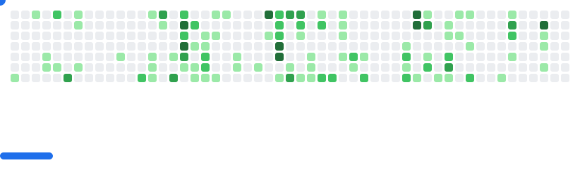

<h1 align="left">
 
</h1>
<figure>
  
 <figcaption></figcaption>
</figure>
  
# Hi, I'm Elender! 
  
## 👤 About me

I am a software developer focused on **clarity, maintainability, and predictable behavior**.
My primary interest is building systems that can be **read, understood, and evolved by other people**, including long after the original implementation.

I have hands-on experience with:

* Compiled and interpreted languages
* Compiler construction, parsers, and ASTs
* Programming language design
* Structured, readable code with explicit control flow

I value simple solutions, even when the problem itself is complex.

---

## 🧠 How I think about software

When developing software, I prioritize:

* **Code that explains itself**
* Simple structures before “clever” abstractions
* Incremental evolution over full rewrites
* Compatibility and long-term maintenance
* Clarity over premature optimization

I treat software as a **long-term asset**, not as disposable output.

---

## 📁 What you will find in this GitHub profile

My repositories usually fall into one of these categories:

* **Tools**: utilities that automate repetitive or error-prone tasks
* **Language infrastructure**: compilers, interpreters, language servers
* **Technical studies**: experiments focused on design, readability, and architecture
* **Refactoring and comparisons**: code rewritten for clarity or reduced complexity

Each project includes documentation explaining:

* The problem being addressed
* The technical decisions made
* Known limitations
* Possible future improvements

---

## 📌 What I am *not* trying to demonstrate here

* Language “tricks” or clever hacks
* Overly compact or opaque code
* Premature micro-optimizations
* Unfinished projects without context

I prefer fewer projects that are **well explained and complete**.

---

## 📬 Contact

If you would like to discuss a project, a design decision, or a technical approach, feel free to open an issue or reach out.

## Contact me     
  
 
 
 
 
<!---->

 

## 🚀 Featured Project

- 💻 I'm currently focused on the **[Português Puro](https://github.com/elenderg/Portugues-Puro)** project, a programming language written in Portuguese with a natural and intuitive syntax featuring an extensive standard library.

---
<!--
   
  -->
## 🔧 Languages, Technologies & Tools

***OS***  
  

  
  
***WEB***  
  

  
  
***Programming Languages*** 
  

  
  
  
***Databases***  
  

  
  

<!--
           
-->

## &#x1f4c8; GitHub Stats

<!---->

<!--

/div> 
  -->

 

 

 <picture>
  <source
    media="(prefers-color-scheme: dark)"
    srcset="images/breakout-dark.svg"
  />
  <source
    media="(prefers-color-scheme: light)"
    srcset="images/breakout-light.svg"
  />
  
</picture>
